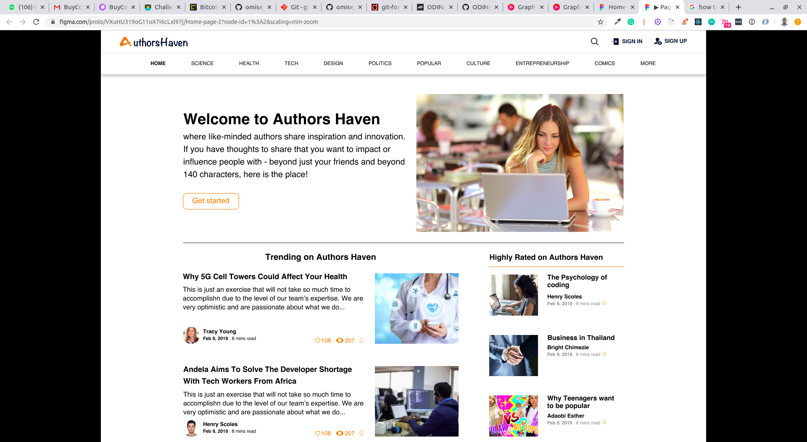

# Authors Haven

## Background

Authors Haven is a platform where like-minded authors share inspiration and innovation by leveraging the modern web.

Homepage...

# Table of Contents

- [Getting Started](#Getting-Started "Goto Getting-Started")
- [Questions](#Questions "Goto Questions")
- [Support or Contributions](#Support-or-Contributions "Support-or-Contributions")

## Getting Started

#### Prerequisites

This application was developed with Ruby **2.4.1** and Ruby on Rails **5.2.3**.

#### How to test

1. Clone this repo - `git clone https://github.com/ODINAKACHUKWU/rails-blog-app.git`

2. Switch into the newly-cloned directory `cd rails-blog-app`

3. Run `bundle install` to install all the necessary gems

4. Start the server using the command `rails s`

5. Visit the site on your browser using `localhost:3000`

## Questions

For more details contact `solomonzbk@gmail.com`

## Support or Contributions

Support or Contributions are highly appreciated. Please send me an email for any suggestion, support or issue. To contribute:

1. Fork this repository or clone the repository with the command
   `$ git clone https://github.com/ODINAKACHUKWU/rails-blog-app`.

2. Change directory into the root of the project directory.

3. Create your feature branch and make your contributions to your local copy of the project.

4. Raise a pull request against the master branch describing what your feature does and how it can be tested.
